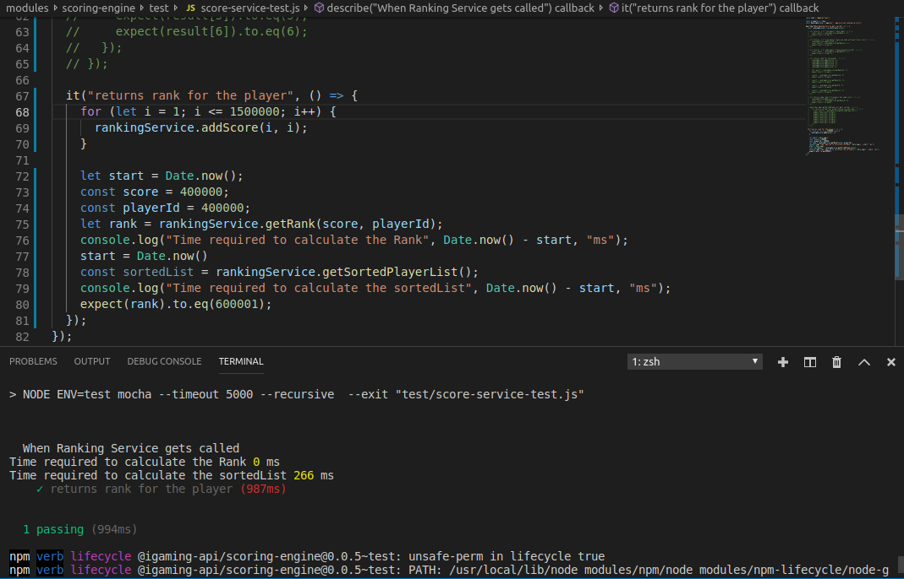

# ranking-and-leaderboard
Service to calculate dynamic rank of a player and leaderboard in linear time

## Insights

In multiplayer games we need to show the Leaderboard as well as player’s score and rank after each round. To encounter this case, there could be multiple approaches like :- 

### Classical Approach

Saving all the information in DBs and using DBs internal functions to calculate the rank(ORDER_BY and RANK()) (Very Inefficient, complexity O(N2), falls down when N is high above 1 lakh).

### Bucket Approach

One approach was to divide the scores in buckets say for example in our case we have points of 10 for correct answer and the maximum a player can score is 400 for a complete contest. So what we can do is we can have a Bucket object with attributes (range and counter). Now, we can divide the scores in buckets (Bucket 1 = 0-100), (Bucket 2 = 100-200), (Bucket 3 = 200-300), (Bucket 4 = 300-400) and each time we update the score for player we will find out the bucket based on the score, we will increment the bucket’s counter  and  will save the reference of the selected Bucket in the players record. And when we need to calculate the the players rank we’ll fetch the bucket referenced in player record we’ll find out the number of players who have more scores than the current player in current Bucket along with the value of counters of the buckets precedes current bucket.  For example(for playerId: 3 the bucket stored in it is 3 and its current score is 250. Now, in order to calculate its rank we need to calculate the number of users who have scores >= 250 + the value of the counter of bucket 2 + the value of the counter of bucket 1  ). Again in this approach we need to pre create the buckets and decide its range. Also the last query to calculate the number of players who have more scores than the current player in a bucket can be slow if our buckets are so big and we have a lot of users in each bucket.

### Self Balanced Binary search tree

Another approach is to use in memory Data Structures like Self Balanced Binary Search Tree(SBBST) with complexity of O(logN). Achieves speedups when N is high.

1) Construct a Self Balanced Binary Tree using scores and playerId of all the players who have participated in the competition.(Complexity O(N(logN))).

2) Now traverse the entire tree in reverse In-Order way(right, root, left) which will give the sorted list of playerId according to the rank(complexity O(N)).

3) We’ll save the entire sorted tree in in-memory databases like Redis/Aerospike (Complexity O(1)).

Complexity of an entire algorithm in case of fetching the leaderboard  + O(N(logN)) + O(N) + O(1). Very near to linear behaviour.

Now, calculate the rank of player, call the function `ranking(score, playerId)` which will calculate and return the rank from the SBBST for the playerId and save the same in DB(complexity O(log(N))) 

Note:- The node of the tree will contain (playerId and Score). 

